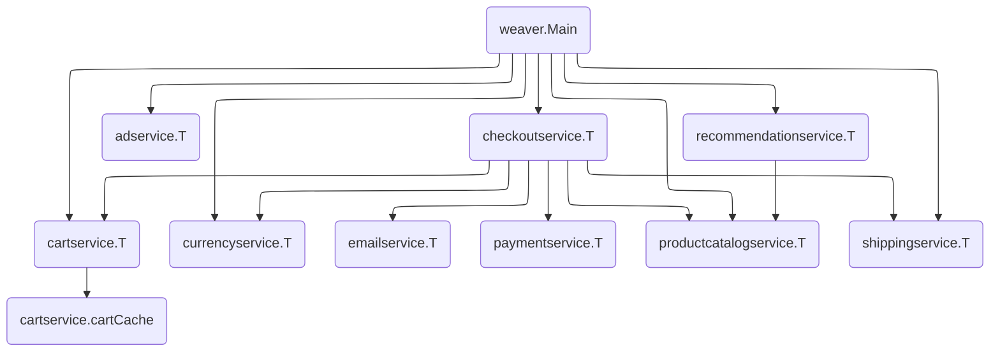

# Online Boutique

This directory contains the port of the Google Cloud's [`Online
Boutique`][boutique] demo application to Service Weaver.



Here are the changes made to the original application:

* All of the services that weren't written in `Go` have been ported to `Go`.
* All of the networking calls have been replaced with the corresponding
  Service Weaver calls.
* All of the logging/tracing/monitoring calls have been replaced with the
  corresponding Service Weaver calls.
* The code is organized as a single Go module.

## Cloud Run

To run Online Boutique on Cloud run, first create a Docker container and upload
it to Artifact Registry according to [these
instructions](https://cloud.google.com/run/docs/building/containers).

```shell
$ docker build -t REGION-docker.pkg.dev/PROJECT_ID/REPO_NAME/onlineboutique:TAG .
$ docker push REGION-docker.pkg.dev/PROJECT_ID/REPO_NAME/onlineboutique:TAG
```

Then, deploy the container to Cloud Run using `gcloud run deploy`:

```shell
$ gcloud run deploy onlineboutique --image=REGION-docker.pkg.dev/PROJECT_ID/REPO_NAME/onlineboutique:TAG --region=REGION --allow-unauthenticated
```

This command should print out a URL that you can use to access the service.
Alternatively, you can curl the service from the command line:

```shell
$ curl -H "Authorization: Bearer $(gcloud auth print-identity-token)" URL
```

[boutique]: https://github.com/GoogleCloudPlatform/microservices-demo
